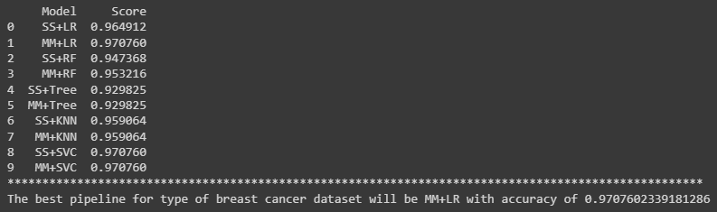
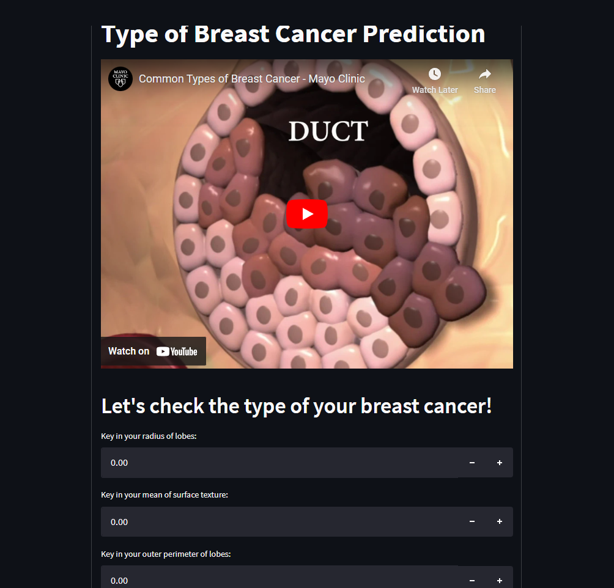

# Breast-Cancer-Prediction
Trained more than 500 data to classify into 2 categories namely Benign and Malignant.

# Predictive Classification Model by Using Machine Learning Model Logistic Regression for Breast Cancer Analysis.
 Using machine learning model to train over 500  Breast Cancer Analysis and Prediction dataset to classify either the person has a Benign type breast cancer or Malignant type breast cancer.

## Description
1. The project's objective is to predict the type of breast cancer based on several medical factors.
2. To assess the type of breast cancer, many medical factors have been measured, which can be used to predict based on these factors.
3. The dataset contains 31 continuous features, 0 categorical features, 1 categorical target and 0 duplicate data. There are also 0 Null values based on the dataset descriptions from the link in the credit section below.
4. The features selected from the dataset are only radius_mean, texture_mean, perimeter_mean, area_mean, concavity_mean, radius_se, perimeter_se, area_se, radius_worst, texture_worst, perimeter_worst, area_worst, compactness_worst, concavity_worst, concave points_worst since they have high percentage correlation (>0.7) to the target ('diagnosis'), which is output.
5. By using sklearn.pipeline method to compare between Min Max Scaler & Standard Scaler for scaling and Logistic Regression, Random Forest, Decision Tree, KNeigbors & SVC for classifier, the machine learning model used that give the highest accuracy is Logistic Regression and the scaler used is Min Max Scaler.
6. Methods that can be used to improve the model such as increasing the amount of data to be train and reducing the outliers.

### Machine learning model link
[sklearn.linear_model.LogisticRegression](https://scikit-learn.org/stable/modules/generated/sklearn.linear_model.LogisticRegression.html)

## Results

### Model score:

## Discussion
1. The best machine learning model achieved 97.7% accuracy during model testing. 
2. Precision, recall and f1 score report 98% and 97%  for output Benign and Malignant respectively. 
3. The machine learning model is deployed by using the streamlit apps. Kindly access the streamlit apps thru this link:
[Type of Breast Cancer Prediction](https://safwanshamsir99-breast-cancer-prediction-app-breast-hwbk3u.streamlit.app/)

## Credits:
Shout out to M Yasser H from Kaggle for the Breast Cancer Prediction Dataset. Check out the dataset by clicking the link below. :smile:
### Dataset link
[Breast Cancer Dataset](https://www.kaggle.com/datasets/yasserh/breast-cancer-dataset)
